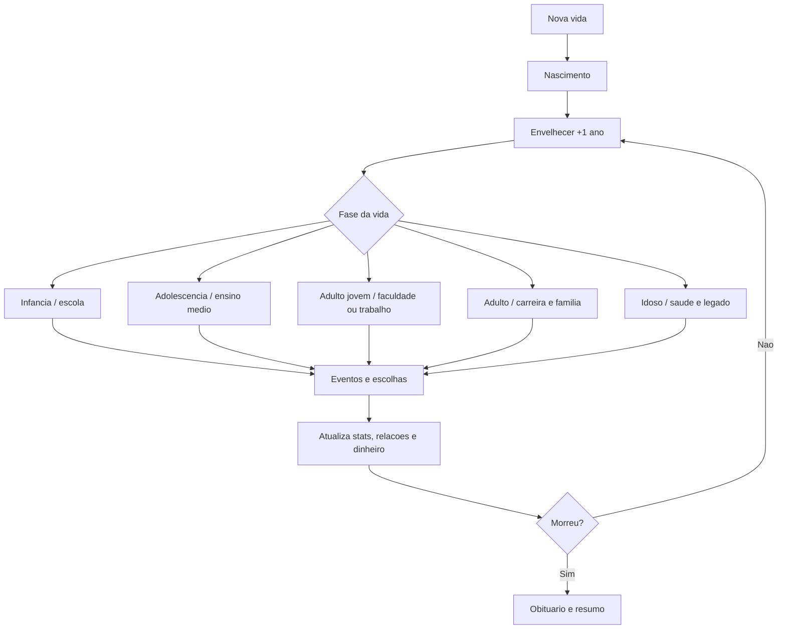

# Levantamento de Requisitos - PathLife V1

Data: 18/07/2026

Projeto: PathLife

Plataforma alvo: Android / Google Play Store

Engine base do projeto atual: Godot 4.6, conforme `path-life/project.godot`

## 1. Objetivo

Criar a primeira versão de um jogo mobile de simulação de vida para Android, com progressão de nascimento ate morte, inspirado no genero de simuladores narrativos como BitLife, mas com identidade propria e uma camada visual isometrica 2D inspirada no tipo de leitura espacial de jogos de vida/casa/familia.

O objetivo da V1 e entregar uma experiencia jogavel completa, curta o suficiente para ser produzida com seguranca, mas rica o bastante para o jogador:

- criar ou iniciar uma vida;
- crescer ano a ano;
- passar por escola e faculdade;
- conseguir emprego;
- construir relacionamento;
- casar;
- ter filhos;
- envelhecer;
- morrer;
- receber um resumo da vida.

## 2. Resumo Executivo

PathLife deve ser tratado como um simulador de vida por escolhas com feedback visual isometrico, nao como uma copia de BitLife. A principal referencia de BitLife e o ciclo narrativo de vida inteira com decisoes, eventos e consequencias. O diferencial de PathLife deve ser mostrar a vida do personagem em ambientes isometricos simples: quarto/casa, escola, faculdade, trabalho e lar familiar.

Para a V1, o jogo nao deve tentar simular construcao livre, decoracao complexa, mundo aberto ou IA social profunda. O foco deve ser o "ciclo de vida completo" funcionando bem.

Recomendacao central:

- usar Godot 4.6, pois o projeto ja esta nessa engine;
- manter o sistema de vida como dados e regras, separado da camada visual;
- criar uma V1 com poucos ambientes, muitos eventos reutilizaveis e progressao clara;
- evitar nomes, textos, telas, icones, personagens ou formulacoes que lembrem diretamente BitLife ou The Sims;
- mirar classificacao adolescente/adulto, pois temas como morte, casamento, filhos, doenca e romance podem elevar a classificacao.

## 3. Pesquisa de Referencias

### 3.1 BitLife

BitLife, da Candywriter, e apresentado nas lojas como um simulador de vida textual baseado em escolhas, no qual o jogador vive do nascimento ate a morte, passa por educacao, carreira, relacionamentos, familia, eventos aleatorios e consequencias. Na Google Play, em 18/07/2026, a pagina do jogo indicava 50M+ downloads, classificacao Mature 17+, anuncios, compras internas e categorias Simulation/Life/Single player/Offline.

Pontos relevantes para PathLife:

- o loop central e "viver mais um ano";
- cada ano pode gerar oportunidades, problemas e eventos;
- as escolhas alteram relacionamentos, carreira, dinheiro, saude, felicidade e futuro;
- a replayabilidade vem de vidas diferentes e consequencias inesperadas;
- parte importante da retencao vem de curiosidade: "o que vai acontecer se eu escolher isto?".

O que nao copiar:

- nome BitLife ou termos similares que confundam usuario;
- layout textual especifico;
- textos de eventos;
- piadas, frases e tom proprietario;
- icones, identidade visual e assets;
- monetizacao, pacotes e telas especificas.

### 3.2 The Sims FreePlay / jogos de vida visuais

The Sims FreePlay destaca familia, romance, filhos, pets, casas, bairros e customizacao visual. Para PathLife, a referencia util nao e copiar a complexidade de simulacao, mas usar a ideia de que relacoes e progresso social ficam mais fortes quando aparecem visualmente.

Pontos aproveitaveis:

- casa como centro emocional do jogo;
- mudancas visuais quando o personagem cresce;
- familia aparecendo no mesmo ambiente;
- casamento, filhos e trabalho comunicados por cenas curtas;
- desbloqueio gradual de locais.

Limite para V1:

- nao implementar construcao livre da casa;
- nao implementar IA autonoma complexa de personagens;
- nao implementar bairros navegaveis grandes;
- nao implementar pets na primeira versao.

### 3.3 Play Store e publicacao

Requisitos importantes verificados em fontes oficiais:

- A partir de 31/08/2026, novos apps e atualizacoes devem mirar Android 16 / API level 36 ou superior para envio a Google Play.
- Novos apps na Google Play devem ser publicados como Android App Bundle (`.aab`).
- A Play Store exige classificacao de conteudo via IARC para cada app.
- O formulario Data Safety deve declarar coleta, compartilhamento, protecao e exclusao de dados, inclusive dados coletados por SDKs de terceiros.
- Apps nao podem infringir propriedade intelectual nem enganar usuarios fingindo relacao com outro app, empresa ou marca.

Implicacao para PathLife:

- preparar build Android com AAB assinado;
- configurar keystore de release;
- manter politica de privacidade;
- declarar corretamente anuncios, analytics e identificadores;
- evitar qualquer aparencia de "BitLife oficial", "The Sims 2D", "clone", "mod" ou "versao alternativa".

### 3.4 Godot

O projeto atual ja usa Godot 4.6 com renderizacao mobile em GL Compatibility. Isso e adequado para uma V1 2D isometrica simples.

Pontos tecnicos relevantes:

- Godot exporta APK para teste local e AAB para submissao na Google Play;
- para AAB e necessario configurar builds Gradle Android;
- o AAB/APK de release precisa ser assinado com keystore nao-debug;
- em Godot 4.x moderno, a documentacao orienta o uso de `TileMapLayer` em vez de depender de um unico `TileMap` antigo;
- tilemaps usam `TileSet` e podem ter varias camadas para piso, paredes, objetos e detalhes.

## 4. Posicionamento do Jogo

Proposta curta:

PathLife e um simulador de vida mobile onde cada ano muda sua historia. Estude, trabalhe, ame, forme familia, enfrente perdas e veja sua vida ganhar forma em pequenos ambientes isometricos.

Pilares:

1. Vida inteira em sessoes curtas.
2. Escolhas simples com consequencias claras.
3. Visual isometrico leve, charmoso e funcional.
4. Eventos variados para replayabilidade.
5. Identidade propria, segura para publicacao.

## 5. Publico-Alvo

Publico primario:

- jogadores mobile de 13+ ou 16+ que gostam de simuladores, historias interativas e jogos de escolha;
- jogadores que gostam de BitLife, The Sims, idle life simulators e jogos casuais de progresso;
- usuarios que jogam em sessoes curtas de 2 a 10 minutos.

Publico secundario:

- jogadores de Android com celulares medianos;
- criadores de conteudo que gostam de narrar vidas absurdas, tragicas ou engracadas.

Observacao de classificacao:

Na V1, evitar conteudo explicito, drogas, crime detalhado, violencia grafica e sexo explicito. Ainda assim, morte, casamento, filhos e doenca exigem respostas honestas no questionario IARC.

## 6. Escopo da V1

### 6.1 Dentro do escopo

- Criacao/inicio de personagem.
- Crescimento por idade.
- Sistema de atributos.
- Escola.
- Faculdade.
- Emprego.
- Relacionamentos.
- Casamento.
- Filhos.
- Familia basica.
- Saude e morte.
- Eventos aleatorios.
- Log da vida.
- Visual isometrico com poucos ambientes.
- Save local.
- Build Android.

### 6.2 Fora do escopo da V1

- Mundo aberto.
- Construcao livre de casa.
- Decoracao arrastavel.
- Pets.
- Crimes complexos.
- Prisao.
- Fama.
- Politica.
- Rede social dentro do jogo.
- Multiplayer.
- Cloud save.
- IA generativa aberta.
- Editor profundo de personagem.
- Milhares de empregos.
- Compra de casas e carros complexa.
- DLCs/pacotes pagos.

## 7. Loop Principal

Fluxo base:

1. Jogador inicia vida.
2. Jogo apresenta personagem, familia inicial e status.
3. Jogador toca em "Envelhecer".
4. O sistema avanca 1 ano.
5. O jogo processa eventos obrigatorios e aleatorios.
6. Jogador escolhe respostas em eventos.
7. Atributos, dinheiro, relacoes e historico sao atualizados.
8. O ambiente isometrico muda conforme fase/local.
9. O ciclo se repete ate a morte.
10. Jogo mostra resumo da vida e oferece nova vida.

Diagrama:



## 8. Requisitos Funcionais

### RF-001 - Criar ou iniciar personagem

O jogo deve permitir iniciar uma vida com:

- nome;
- sobrenome;
- genero;
- cidade/pais ficticio ou real simplificado;
- data/ano de nascimento interno;
- familia inicial;
- aparencia simples do avatar.

Prioridade: P0

### RF-002 - Sistema de idade

O jogo deve ter um botao principal para avancar 1 ano de vida por vez.

Regras:

- idade inicial: 0;
- morte possivel por idade avancada, doenca ou evento;
- fases de vida alteram opcoes disponiveis;
- o log deve registrar eventos importantes por idade.

Prioridade: P0

### RF-003 - Atributos do personagem

A V1 deve conter os seguintes atributos:

| Atributo | Funcao |
|---|---|
| Saude | Afeta risco de doenca/morte e energia geral |
| Felicidade | Afeta eventos emocionais e escolhas sociais |
| Inteligencia | Afeta escola, faculdade e empregos qualificados |
| Aparencia | Afeta alguns eventos sociais e romance |
| Dinheiro | Afeta escolhas de faculdade, casamento e qualidade de vida |
| Disciplina | Afeta estudo, trabalho e promocao |

Prioridade: P0

### RF-004 - Log de vida

O jogo deve registrar uma linha de historico para eventos importantes:

- nascimento;
- entrada na escola;
- formatura;
- entrada na faculdade;
- primeiro emprego;
- namoro;
- casamento;
- nascimento de filhos;
- doencas;
- morte de familiares;
- morte do personagem.

Prioridade: P0

### RF-005 - Escola

O personagem deve entrar automaticamente na escola em idade definida pelo jogo.

Mecanicas:

- desempenho escolar;
- eventos com colegas;
- eventos com professores;
- escolha "estudar mais";
- escolha "fazer amizade";
- risco de notas baixas;
- conclusao da escola.

Prioridade: P0

### RF-006 - Faculdade

Ao terminar a escola, o jogador deve poder:

- entrar direto no trabalho;
- tentar faculdade;
- escolher curso;
- receber resultado baseado em inteligencia, dinheiro e desempenho.

Cursos da V1:

- Computacao;
- Medicina;
- Direito;
- Educacao;
- Administracao;
- Engenharia;
- Artes;
- Psicologia.

Prioridade: P0

### RF-007 - Trabalho

O jogador deve conseguir procurar emprego apos a escola ou faculdade.

Campos de emprego:

- titulo;
- salario anual;
- requisito minimo;
- estresse;
- chance de promocao;
- risco de demissao.

Empregos iniciais da V1:

- Atendente;
- Caixa;
- Auxiliar administrativo;
- Professor;
- Programador;
- Enfermeiro;
- Medico;
- Advogado;
- Engenheiro;
- Artista.

Prioridade: P0

### RF-008 - Relacionamentos

O jogo deve manter lista basica de pessoas ligadas ao personagem:

- pais;
- irmaos, se gerados;
- amigos;
- parceiro/parceira;
- conjugue;
- filhos.

Cada relacionamento deve ter:

- nome;
- idade;
- tipo de relacao;
- afinidade;
- saude;
- status vivo/morto.

Prioridade: P0

### RF-009 - Namoro e casamento

O jogador deve poder:

- conhecer pessoa;
- iniciar namoro;
- terminar;
- pedir casamento;
- casar;
- divorciar.

Na V1, o sistema pode ser simples e orientado por eventos, sem simulacao social profunda.

Prioridade: P0

### RF-010 - Filhos e familia

O jogador casado ou em relacionamento estavel deve poder ter filhos por evento ou decisao.

Na V1, filhos devem aparecer como registros de relacionamento e, se possivel, como pequenos avatares no ambiente da casa.

Prioridade: P0

### RF-011 - Saude e morte

O personagem pode morrer por:

- idade avancada;
- doenca;
- acidente/evento raro;
- baixa saude persistente.

Ao morrer, o jogo deve mostrar:

- idade final;
- profissao principal;
- estado civil;
- quantidade de filhos;
- dinheiro final;
- eventos marcantes;
- avaliacao/resumo da vida.

Prioridade: P0

### RF-012 - Eventos aleatorios

O jogo deve ter um sistema de eventos com:

- id;
- titulo;
- texto;
- fase de vida;
- pre-condicoes;
- opcoes de escolha;
- efeitos nos atributos;
- efeitos em dinheiro;
- efeitos em relacionamentos;
- possivel registro no log.

Exemplo conceitual:

```json
{
  "id": "school_test_001",
  "phase": "school",
  "title": "Prova surpresa",
  "text": "A professora aplicou uma prova surpresa.",
  "choices": [
    { "label": "Tentar com calma", "effects": { "intelligence": 1, "happiness": -1 } },
    { "label": "Chutar respostas", "effects": { "discipline": -1 } }
  ]
}
```

Prioridade: P0

### RF-013 - Visual isometrico

A V1 deve mostrar ambientes isometricos simples:

- quarto/casa inicial;
- escola;
- faculdade;
- trabalho;
- casa familiar.

Regras visuais:

- avatar do personagem muda por fase de vida;
- ambiente exibido deve refletir a atividade principal atual;
- nao precisa haver movimentacao livre na V1;
- animacoes simples bastam: idle, andar curto, sentar, comemorar, triste.

Prioridade: P0

### RF-014 - Interface mobile

A UI deve conter:

- painel superior com idade, dinheiro e saude;
- area central visual isometrica;
- painel de evento/log;
- botao principal "Envelhecer";
- abas: Vida, Relacoes, Atividades, Perfil.

Prioridade: P0

### RF-015 - Save local

O jogo deve salvar automaticamente:

- personagem atual;
- idade;
- atributos;
- dinheiro;
- relacoes;
- historico;
- estado do mundo;
- flags importantes.

Prioridade: P0

## 9. Requisitos Nao Funcionais

### RNF-001 - Performance mobile

O jogo deve rodar bem em celulares Android intermediarios.

Metas:

- 30 FPS minimo;
- 60 FPS desejavel;
- carregamento inicial abaixo de 5 segundos em aparelho medio;
- uso de memoria controlado;
- poucos efeitos pesados.

Prioridade: P0

### RNF-002 - Offline first

A V1 deve funcionar offline. Internet so deve ser necessaria se houver anuncios, analytics ou futuras compras.

Prioridade: P0

### RNF-003 - Baixo consumo de bateria

Como o jogo e casual, evitar simulacoes em tempo real desnecessarias. O processamento principal deve ocorrer ao envelhecer ou abrir telas.

Prioridade: P1

### RNF-004 - Privacidade

Coletar o minimo possivel.

Na V1 ideal:

- sem login;
- sem localizacao;
- sem contatos;
- sem microfone/camera;
- analytics anonimo, se usado;
- politica de privacidade clara;
- declarar SDKs de anuncios/analytics no Data Safety.

Prioridade: P0

### RNF-005 - Conteudo seguro para loja

Evitar:

- conteudo sexual explicito;
- violencia grafica;
- incentivo a drogas;
- discurso de odio;
- conteudo que envolva menores em situacoes sensiveis;
- uso de marcas reais sem permissao;
- prompts que imitem outro jogo.

Prioridade: P0

### RNF-006 - Manutenibilidade

Eventos, empregos, cursos e fases devem ser configuraveis por arquivos de dados sempre que possivel.

Sugestao:

- `data/events.json`;
- `data/jobs.json`;
- `data/courses.json`;
- `data/life_phases.json`;
- `data/names.json`.

Prioridade: P1

## 10. Modelo de Dados Sugerido

### PlayerLife

| Campo | Tipo | Descricao |
|---|---|---|
| id | string | Identificador do save |
| first_name | string | Nome |
| last_name | string | Sobrenome |
| age | int | Idade atual |
| gender | string | Genero |
| phase | string | Fase de vida |
| health | int | 0 a 100 |
| happiness | int | 0 a 100 |
| intelligence | int | 0 a 100 |
| appearance | int | 0 a 100 |
| discipline | int | 0 a 100 |
| money | int | Dinheiro atual |
| education_status | string | Escola/faculdade |
| job_id | string/null | Emprego atual |
| relationship_status | string | Solteiro, namorando, casado etc. |
| relatives | array | Lista de pessoas ligadas |
| life_log | array | Historico |
| flags | dictionary | Marcadores de eventos |

### Relationship

| Campo | Tipo | Descricao |
|---|---|---|
| id | string | Identificador |
| name | string | Nome |
| age | int | Idade |
| role | string | Pai, mae, amigo, parceiro, filho |
| affinity | int | 0 a 100 |
| health | int | 0 a 100 |
| alive | bool | Vivo/morto |

### LifeEvent

| Campo | Tipo | Descricao |
|---|---|---|
| id | string | Identificador unico |
| title | string | Titulo curto |
| body | string | Texto do evento |
| phase | array/string | Fases aplicaveis |
| min_age | int | Idade minima |
| max_age | int | Idade maxima |
| conditions | dictionary | Pre-condicoes |
| choices | array | Opcoes |
| weight | int | Peso de sorteio |
| once | bool | Se pode repetir |

## 11. Conteudo Minimo da V1

Quantidade recomendada para nao parecer vazio:

| Categoria | Quantidade minima |
|---|---:|
| Eventos de infancia/escola | 25 |
| Eventos de adolescencia | 20 |
| Eventos de faculdade | 15 |
| Eventos de trabalho | 25 |
| Eventos de relacionamento | 25 |
| Eventos de familia | 20 |
| Eventos de saude/morte | 15 |
| Empregos | 10 |
| Cursos | 8 |
| Ambientes isometricos | 5 |
| Animacoes de avatar | 5 |

Total recomendado inicial: 145 eventos.

Quantidade minima absoluta para prototipo jogavel: 60 eventos.

## 12. Sistema Visual Isometrico

### Ambientes da V1

1. Quarto infantil / casa inicial.
2. Sala de aula.
3. Campus/faculdade simplificada.
4. Ambiente de trabalho generico.
5. Casa adulta/familiar.

### Camadas sugeridas em Godot

- `FloorLayer`: piso/base.
- `WallLayer`: paredes e estrutura.
- `FurnitureLayer`: moveis.
- `CharacterLayer`: personagem e familiares.
- `FXLayer`: feedbacks visuais simples.
- `UILayer`: interface.

### Regras de camera

- camera fixa ou semi-fixa;
- proporcao pensada para vertical mobile;
- zoom suficiente para entender o ambiente;
- sem necessidade de pan livre na V1.

### Avatar

Fases visuais:

- bebe;
- crianca;
- adolescente;
- adulto;
- idoso.

Estados:

- neutro;
- feliz;
- triste;
- doente;
- comemorando.

## 13. UX Mobile

Tela principal:

- topo: idade, dinheiro, saude;
- centro: cena isometrica;
- baixo: log/evento atual;
- acao fixa: "Envelhecer";
- navegacao por abas.

Principios:

- botao principal sempre visivel;
- texto curto em eventos;
- escolhas com consequencia entendivel;
- evitar telas cheias demais;
- eventos importantes devem gerar feedback visual e sonoro.

## 14. Balanceamento Inicial

Regras simples:

- atributos variam de 0 a 100;
- eventos pequenos alteram de 1 a 5 pontos;
- eventos grandes alteram de 8 a 20 pontos;
- emprego aumenta dinheiro por ano;
- faculdade reduz dinheiro ou gera divida, mas aumenta acesso a carreiras melhores;
- felicidade deve cair com estresse, morte familiar e rejeicoes;
- saude deve cair lentamente com idade;
- bons habitos podem reduzir risco de morte cedo.

Morte:

- antes dos 50: rara e geralmente por evento;
- 50 a 70: chance baixa/moderada;
- 70 a 90: chance progressiva;
- 90+: chance alta.

## 15. Monetizacao Recomendada para V1

Opcoes seguras:

- anuncios recompensados opcionais;
- remover anuncios;
- pacote cosmetico de avatares;
- pacote de temas visuais.

Evitar na V1:

- paywall para progresso basico;
- anuncio forçado a cada envelhecimento;
- escolhas importantes bloqueadas por anuncio;
- compras que parecam apostas ou premio aleatorio pago.

Motivo:

Avaliacoes publicas de jogos similares frequentemente reclamam de excesso de anuncios. A V1 deve ganhar confianca antes de monetizar agressivamente.

## 16. Requisitos de Play Store

Checklist:

- nome original: PathLife ou outro nome proprio;
- icone proprio;
- screenshots sem marcas de terceiros;
- descricao sem alegar relacao com BitLife ou The Sims;
- AAB assinado;
- target API compativel com politica vigente;
- politica de privacidade publicada;
- Data Safety preenchido;
- classificacao IARC preenchida;
- SDKs de anuncios/analytics revisados no Google Play SDK Index;
- teste fechado antes do lancamento publico;
- pagina da loja com imagens reais do jogo, nao mockups enganosos.

Observacao:

Se a conta de desenvolvedor pessoal foi criada apos 13/11/2023, a Google Play pode exigir requisitos de teste fechado antes da publicacao em producao. Confirmar no Play Console da conta real.

## 17. Riscos e Mitigacoes

| Risco | Severidade | Mitigacao |
|---|---:|---|
| Parecer copia de BitLife | Alta | Nome, UI, textos, arte e tom totalmente proprios |
| Escopo visual virar The Sims completo | Alta | V1 com ambientes fixos e sem construcao livre |
| Falta de conteudo deixar jogo repetitivo | Alta | Criar minimo de 100+ eventos antes do beta |
| Reprovacao na Play Store por rating/dados | Alta | Preencher IARC e Data Safety com honestidade |
| Baixa performance em Android | Media | GL Compatibility, sprites otimizados, poucos efeitos |
| Eventos dificeis de manter | Media | Sistema dirigido por JSON/dados |
| Monetizacao irritar usuarios | Media | Priorizar anuncio recompensado opcional |
| Save corrompido | Media | Save versionado e backup simples |

## 18. Roadmap

### Fase 1 - Prototipo de vida textual

Duracao sugerida: 1 a 2 semanas

Entregas:

- criacao/inicio de vida;
- envelhecimento;
- atributos;
- log;
- morte;
- 30 eventos;
- save local.

### Fase 2 - Sistemas principais

Duracao sugerida: 2 a 3 semanas

Entregas:

- escola;
- faculdade;
- empregos;
- relacionamentos;
- casamento;
- filhos;
- 80 eventos.

### Fase 3 - Visual isometrico

Duracao sugerida: 3 a 4 semanas

Entregas:

- casa;
- escola;
- faculdade;
- trabalho;
- avatar por fase;
- feedback visual para eventos.

### Fase 4 - Beta Android

Duracao sugerida: 2 semanas

Entregas:

- export Android;
- AAB;
- testes em aparelhos reais;
- balanceamento;
- correcoes de save;
- 120+ eventos;
- tela de obituario.

### Fase 5 - Preparacao Play Store

Duracao sugerida: 1 a 2 semanas

Entregas:

- politica de privacidade;
- Data Safety;
- IARC;
- screenshots;
- trailer curto opcional;
- teste fechado;
- release candidate.

## 19. Backlog Pos-V1

Possiveis expansoes:

- pets;
- casas melhores;
- carros;
- fama;
- midias sociais ficticias;
- crime leve/risco juridico;
- negocios proprios;
- heranca;
- geracoes familiares;
- eventos por pais/cultura;
- colecoes de conquistas;
- desafios semanais;
- cloud save;
- idiomas adicionais.

## 20. Criterios de Aceite da V1

A V1 pode ser considerada pronta quando:

- uma vida completa pode ser jogada do nascimento ate a morte;
- o jogador consegue passar por escola, faculdade, trabalho, casamento e filhos;
- ha pelo menos 100 eventos implementados;
- o save local funciona apos fechar e abrir o jogo;
- ha pelo menos 5 ambientes isometricos;
- o jogo roda em Android real;
- AAB de release e gerado e assinado;
- nao ha uso de marcas, textos ou assets de terceiros sem licenca;
- politica de privacidade e formularios da Play Store estao prontos;
- o jogo nao trava durante uma vida completa em teste.

## 21. Fontes Consultadas

- BitLife na Google Play: https://play.google.com/store/apps/details?id=com.candywriter.bitlife
- BitLife na App Store: https://apps.apple.com/us/app/bitlife-life-simulator/id1374403536
- The Sims FreePlay, Electronic Arts: https://www.ea.com/games/the-sims/the-sims-freeplay
- Google Play target API level requirements: https://support.google.com/googleplay/android-developer/answer/11926878
- Google Play Data Safety: https://support.google.com/googleplay/android-developer/answer/10787469
- Google Play Content Ratings/IARC: https://support.google.com/googleplay/android-developer/answer/9898843
- Google Play Developer Program Policy / Intellectual Property: https://support.google.com/googleplay/android-developer/answer/17190352
- Google Play Impersonation Policy: https://support.google.com/googleplay/android-developer/answer/9888374
- Android App Bundles: https://developer.android.com/guide/app-bundle
- Godot Android export: https://docs.godotengine.org/en/stable/tutorials/export/exporting_for_android.html
- Android Developers - export Godot projects to Android: https://developer.android.com/games/engines/godot/godot-export
- Godot TileMap documentation: https://docs.godotengine.org/en/4.4/classes/class_tilemap.html
- Unity Isometric Tilemap reference: https://docs.unity3d.com/6000.5/Documentation/Manual/tilemaps/work-with-tilemaps/isometric-tilemaps/create-isometric-tilemap.html
- U.S. Copyright Office - Games: https://www.copyright.gov/register/tx-games.html
- U.S. Copyright Office - What Does Copyright Protect: https://www.copyright.gov/help/faq/faq-protect.html

## 22. Observacao Legal

Este documento nao e aconselhamento juridico. Para lancamento comercial, especialmente se o marketing citar jogos famosos como referencia, recomenda-se revisao juridica de nome, icone, descricao, screenshots, conteudo e monetizacao.
