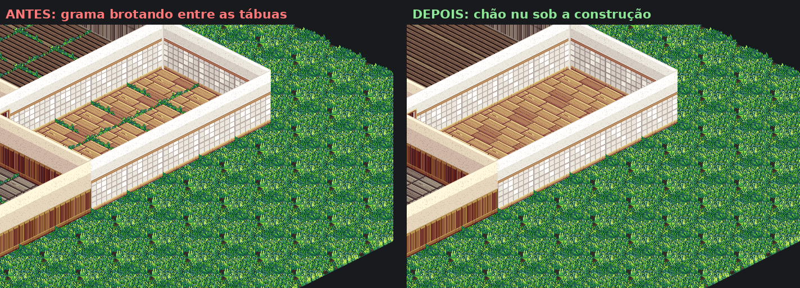

# Tutorial completo — adicionar uma estrutura com piso, paredes, janelas e portas no PathLife

Este guia ensina, em linguagem simples, como criar uma estrutura nova no mundo
procedural do PathLife usando os tiles corretos que já foram adicionados ao
projeto. A cena de trabalho atual é uma **casa 7 × 8**, com pisos, paredes de
vários ambientes, colisão e uma entrada.

O procedimento foi escrito para o estado atual do projeto em Godot 4.6. O
ambiente já está preparado para você desenhar a construção com `TileMapLayer`,
sem criar um `Sprite2D` para cada imagem:

```text
res://presentation/world/structures/casa_madeira_tilemap.tscn
res://data/world/structures/casa_madeira_tileset.tres
```

> Resultado esperado: ao executar o mundo, a casa será sorteada pelo gerador,
> o terreno ficará plano debaixo dela, o piso acompanhará a grade isométrica e
> as paredes poderão bloquear o jogador.

---

## 1. O que existe hoje no projeto

Uma estrutura do PathLife é formada por duas partes:

1. uma cena `.tscn`, que contém tudo o que aparece ou interage: piso, paredes,
   colisões, móveis e marcadores;
2. um recurso `.tres`, que contém as regras: tamanho ocupado, chance de nascer,
   biomas permitidos e adaptação do terreno.

O fluxo completo é este:

```text
PNG do piso, das paredes, das janelas e das portas
        ↓
casa_madeira_tileset.tres      paleta, alinhamento e colisões
        ↓
casa_simples.tscn              TileMapLayers pintados
        ↓
casa_simples.tres              regras procedurais
        ↓
structure_pool do bioma        registro da estrutura
        ↓
StructurePlanner               escolhe onde ela nasce
        ↓
StructurePass                  achata e protege o terreno
        ↓
ChunkView                      instancia a casa no mundo
```

Os locais principais são:

```text
res://assets/world/structures/          imagens PNG
res://presentation/world/structures/    cenas .tscn
res://data/world/structures/            definições .tres
res://data/world/biomes/                biomas onde a estrutura pode nascer
res://world_generation/structures/      funcionamento interno do sistema
```

### Exemplo já existente

```text
res://assets/world/structures/piso_madeira.png
res://presentation/world/structures/deck_madeira.tscn
res://data/world/structures/deck_madeira.tres
```

O deck tem 16 peças de piso, formando uma área 4 × 4. Ele não possui paredes
nem colisões.

### Novo pacote de construção

Os tiles novos estão organizados em:

```text
res://assets/world/structures/casa_madeira/
├── pisos/
│   ├── banheiro/
│   ├── cozinha/
│   ├── lazer/
│   └── sala/
├── paredes/
│   ├── banheiro/
│   ├── cozinha/
│   ├── lazer/
│   └── sala/
├── janelas/
│   ├── banheiro/
│   ├── cozinha/
│   ├── lazer/
│   └── sala/
├── portas/
│   ├── banheiro/
│   ├── cozinha/
│   ├── lazer/
│   └── sala/
└── _referencias/                 exemplos; ignorados pelo Godot
```

Há 8 pisos, 108 paredes únicas, 96 janelas e 192 peças de porta/montante. As
janelas cobrem os quatro ambientes e orientações, com vidro ou vazadas. As portas cobrem
os quatro ambientes, as quatro orientações, os estados `aberta`, `fechada` e
`vao`, além dos modos visuais `baixa`, `cheia` e `fantasma`. As imagens de
demonstração e contato são apenas referências e não entram nos atlas.

O projeto também já possui:

```text
res://assets/world/structures/casa_madeira/atlases/        spritesheets da paleta
res://data/world/structures/casa_madeira_tileset.tres      TileSet reutilizável
res://presentation/world/structures/casa_madeira_tilemap.tscn
```

A cena de trabalho preserva o desenho 7×8 que está sendo editado. Você pode
apagar, pintar e redimensionar tudo pelo painel **TileMap**.

### Atenção: existem dois significados diferentes para “parede”

O campo `wall_id` dos biomas **não cria paredes de uma casa**. Ele escolhe a
imagem de terra que aparece nas laterais do relevo quando há diferença de
altura.

As paredes da construção pertencem à cena `casa_simples.tscn`. Neste ambiente,
elas são células pintadas no `TileMapLayer` chamado `Paredes`; a imagem e a
colisão já vêm juntas no tile.

---

## 2. Pequeno dicionário para quem está começando

| Termo | Significado neste projeto |
|---|---|
| Cena | Arquivo `.tscn` que guarda uma árvore de nós do Godot. |
| Recurso | Arquivo `.tres` que guarda configurações. |
| Nó | Uma peça da cena, como `Sprite2D`, `StaticBody2D` ou `Marker2D`. |
| Sprite | Uma imagem exibida no jogo. |
| TileSet | Paleta que reúne imagens, alinhamentos e colisões dos tiles. |
| TileMapLayer | Camada em que você pinta tiles sobre uma grade. |
| Atlas | Spritesheet que reúne várias imagens em um único PNG. |
| Footprint | Retângulo de células ocupado pela estrutura. |
| Bioma | Tipo de região, como `campo`, `floresta` ou `savana`. |
| Colisão | Forma invisível que impede o jogador de atravessar um objeto. |
| Y-Sort | Ordenação que decide o que aparece na frente ou atrás. |
| Origem | Ponto `(0, 0)` da cena, mostrado pela cruz do editor 2D. |

---

## 3. Antes de começar

### 3.1 Abra o projeto correto

No Godot Project Manager, importe ou abra:

```text
C:\Users\danil\Desktop\PathLife\PathLife-main\project.godot
```

Esse é o caminho desta máquina. Se o projeto for movido ou clonado em outro
computador, escolha o arquivo `project.godot` que estiver dentro da pasta
`PathLife-main`.

No painel **FileSystem** do Godot, todos os caminhos deste tutorial começam com
`res://`. Essa palavra representa a pasta `PathLife-main`.

### 3.2 Veja o exemplo funcionando

1. Abra `res://scenes/world/world_demo.tscn`.
2. Pressione **F6** para executar essa cena.
3. Use `W`, `A`, `S` e `D` para andar; use `Shift` para correr.
4. Explore até encontrar um deck de madeira.

O nascimento é procedural. Com a mesma semente, as estruturas aparecem sempre
nos mesmos lugares.

Essa cena de laboratório é ótima para conferir geração, posição e aparência,
mas seu ator é um `Node2D` sem corpo de física. Para testar se uma parede
realmente bloqueia o Player, será necessário executar a cena principal com
**F5**, conforme a seção 14.

### 3.3 Não execute o recriador de recursos durante este tutorial

O arquivo abaixo recria os `.tres` do mundo a partir do código:

```text
res://tools/build_world_resources.gd
```

No estado atual, ele conhece `deck_madeira` e `casa_madeira`. Uma estrutura nova
adicionada somente pelo Inspector ainda pode desaparecer dos arrays de biomas se
essa ferramenta for executada antes de você atualizar o builder.

Primeiro faça todo o tutorial pelo editor. A seção 16 explica como tornar a
estrutura permanente também no recriador.

---

## 4. Escolha o comportamento da construção

Antes de montar a cena, escolha um destes dois tipos:

| Tipo | Interior | Configuração recomendada |
|---|---|---|
| Prédio fechado | O jogador não entra | `footprint_blocks_movement = true` |
| Casa caminhável | O jogador entra pela abertura | `footprint_blocks_movement = false` e colisão somente nas paredes |

Este tutorial monta a segunda opção: uma construção caminhável. Para o primeiro
teste, ela será uma casa em estilo **cutaway**, com o lado da frente aberto. Isso
reduz problemas de visão e permite enxergar o personagem sobre o piso.

### O chão embaixo da construção

A definição da estrutura já vem com `clears_ground_cover = true`: o mundo troca
a grama do footprint pela terra nua do bioma antes de a cena entrar. Isso não é
enfeite — é o que impede o mato de brotar por cima do seu piso.

A arte de chão ocupa 128×106 px para um losango de 128×64. A sobra de cima são
as folhas: elas transbordam a célula de propósito, para a grama ter volume.
Entre duas gramas ninguém percebe. Sob uma casa sim: a célula da FRENTE é
desenhada depois da de trás, então suas folhas caem sobre o PISO.



Duas regras práticas ao criar a sua estrutura:

* **`footprint` igual à área que a cena realmente cobre de piso.** Pintar piso
  além do footprint não deixa mais grama para trás (o mundo lê as células de
  piso direto da cena), mas o footprint continua sendo quem achata o terreno e
  reserva o lugar contra outras construções — se ele for menor que a casa, o
  relevo entra por baixo dela; se for maior, sobra terra ao redor.
* **Piso aberto (deck, pátio, quadra) pede `bare_ground_margin = 1`.** Sem
  paredes na borda, a grama da célula vizinha encosta na última fileira de
  tábuas. Com paredes, `0` basta — a própria parede cobre a folha.

---

## 5. Conheça os tiles corretos

Você não precisa mais desenhar paredes provisórias. O pacote já contém todas as
imagens necessárias, com transparência e alinhamento compatíveis entre si.

### 5.1 Escolha o ambiente

Cada grupo tem a mesma geometria, mas uma aparência diferente:

| Pasta | Uso visual sugerido |
|---|---|
| `banheiro` | azulejos claros |
| `cozinha` | parede clara com acabamento de cozinha |
| `lazer` | acabamento azul-claro |
| `sala` | madeira marrom |

O exemplo usa `sala`. Depois que tudo funcionar, você pode selecionar a fonte de
outro ambiente e repintar as mesmas células sem mudar posições ou colisões.

### 5.2 Escolha o piso

Em cada ambiente existem duas peças:

| Arquivo | Tamanho | Quando usar |
|---|---:|---|
| `*_bloco.png` | 128 × 76 | Mostra o topo e uma pequena espessura lateral. |
| `*_topo.png` | 128 × 64 | Mostra apenas a superfície plana. |

Neste tutorial use:

```text
res://assets/world/structures/casa_madeira/pisos/sala/sala_bloco.png
```

Esse arquivo é idêntico ao antigo
`res://assets/world/structures/piso_madeira.png`, portanto o deck continuará
com a mesma aparência. A nova cópia está junto do restante do kit e deixa mais
claro qual piso pertence à sala.

### 5.3 Entenda os nomes das paredes

Todas as paredes de produção medem 128 × 158. Não recorte a área transparente:
essa margem é o que faz as peças encaixarem com a mesma origem de textura.

| Parte do nome | Significado |
|---|---|
| `ne`, `nw`, `se`, `sw` | Orientação da parede na grade isométrica. |
| `canto` | Duas paredes traseiras unidas em um canto interno. |
| `quina_n/e/s/w` | Encontro externo voltado para aquela direção. |
| `cheia` | Parede de altura completa. |
| `baixa` | Parede baixa, útil para deixar o interior visível. |
| `fantasma` | Versão visual pontilhada para ocultação/cutaway. |

Os arquivos `*_parede_ne.png` e `*_parede_nw.png` são aliases das versões
`*_ne_cheia.png` e `*_nw_cheia.png`. Para evitar dúvida, este guia usa sempre os
nomes terminados em `_cheia`.

Na fonte `Paredes_Sala` do painel TileMap, as colunas aparecem nesta ordem:

```text
NE | NW | SE | SW | quina N | quina E | quina S | quina W | canto
```

As três linhas são `baixa`, `cheia` e `fantasma`, inclusive para o `canto`.
As fontes `Paredes_Banheiro`, `Paredes_Cozinha` e
`Paredes_Lazer` usam exatamente a mesma ordem.

As peças `SE`, `SW` e `quina_*` servem para construções fechadas ou formatos
mais complexos. Consulte as imagens da pasta `_referencias/paredes` pelo
Explorador de Arquivos do Windows quando quiser comparar os encaixes. Essa pasta
tem `.gdignore`, por isso não aparece como conteúdo importável no Godot.

### 5.4 Entenda as janelas

Cada ambiente possui uma fonte `Janelas_*`. As quatro primeiras colunas são
`janela_ne`, `janela_nw`, `janela_se` e `janela_sw`; as quatro seguintes são as
mesmas orientações na variante `janela_vazada_*`. Todas usam as linhas `baixa`,
`cheia` e `fantasma`, mantêm a colisão da parede substituída e acompanham o botão
global de visibilidade.

### 5.5 Entenda as portas

Cada ambiente também aparece como uma fonte `Portas_*` no painel TileMap. Ela
possui portas `NE`, `NW`, `SE` e `SW` nos estados:

| Estado | Visual | Colisão |
|---|---|---|
| `fechada` | Folha fechada | Bloqueia toda a aresta. |
| `aberta` | Vão com a folha vista de perfil | Centro atravessável; laterais sólidas. |
| `vao` | Somente moldura | Centro atravessável; laterais sólidas. |
| `montante_n/e/s/w` | Poste de união | Decorativo. |

As linhas continuam sendo `baixa`, `cheia` e `fantasma`. Por isso as portas
acompanham automaticamente o mesmo botão que alterna a visualização das
paredes. O modo fantasma é gerado com alpha uniforme; não use diretamente os
PNGs pontilhados, pois o xadrez de 1 px cintila durante o movimento da câmera.

### 5.6 Confira a importação

Os atlas já foram importados com compressão sem perda e mipmaps desligados. A
cena e seus `TileMapLayer` já usam:

```text
Texture Filter = Nearest
```

Isso impede que o pixel art fique borrado. As colisões das paredes e os offsets
de alinhamento também já fazem parte do TileSet; não altere `Texture Origin` nem
recorte os atlas.

---

## 6. Abra a cena preparada

1. No painel **FileSystem**, abra
   `res://presentation/world/structures/`.
2. Dê dois cliques em `casa_madeira_tilemap.tscn`.
3. Se quiser preservar o exemplo original, use **Scene > Save As** e salve como
   `casa_simples.tscn` antes de pintar.

A árvore já está pronta:

```text
CasaMadeiraTileMap                 StructureRoot, Y-Sort ligado
├── Piso                           TileMapLayer, sem colisão
├── Paredes                        TileMapLayer, colisão automática
├── ParedesSemColisao              TileMapLayer, colisão desligada
└── Marcadores
    ├── EntranceMarker
    ├── RoadMarker
    └── NPCSpawnMarker
```

As três camadas compartilham:

```text
res://data/world/structures/casa_madeira_tileset.tres
```

Não altere `Position = (-64, -32)`, `Z Index = 0` ou o TileSet das camadas.
Esses valores fazem a célula `(0,0)` encaixar na origem esperada pelo gerador e
mantêm a ordenação junto do terreno e do Player.

O exemplo atual possui uma área de piso 7×8 e as paredes que você já pintou.
Você pode continuar dele ou usar **Save As** antes de desenhar outro formato.

Deixe a propriedade `definition` da raiz vazia. O recurso `.tres` apontará para
a cena; preencher a referência inversa criaria um ciclo desnecessário.

---

## 7. Pinte o piso

### 7.1 Abra a paleta

1. Selecione o nó `Piso` na árvore da cena.
2. Abra o painel **TileMap** na parte inferior do Godot.
3. Selecione a fonte `Pisos_Banheiro_Cozinha_Lazer_Sala`.

A paleta possui quatro colunas:

```text
Banheiro | Cozinha | Lazer | Sala
```

A linha superior usa piso com espessura (`bloco`) e a inferior usa somente a
superfície (`topo`).

### 7.2 Desenhe

1. Clique no piso desejado na paleta.
2. Escolha o lápis para pintar uma célula de cada vez.
3. Use a ferramenta de retângulo para criar rapidamente um cômodo inteiro.
4. Use o botão direito ou a borracha para apagar.
5. Use seleção, copiar e colar para repetir uma área pronta.

Você não precisa calcular posições. A grade converte automaticamente:

```text
célula (x,y) → posição ((x-y)×64, (x+y)×32)
```

O piso não possui colisão. O chão lógico do mundo continua responsável pela
caminhada, enquanto o `StructurePass` achata o terreno sob o footprint.

### 7.3 Se mudar o tamanho

Se pintar uma casa 6×5, selecione a raiz e use
`Footprint Preview = (6, 5)`. Mais tarde, o recurso `.tres` também deverá usar
`footprint = (6, 5)`. O tamanho pintado e o footprint precisam combinar.

O gizmo da raiz está desligado na cena-base: considere a própria grade do
TileMap como referência visual.

---

## 8. Pinte paredes com colisão automática

### 8.1 Escolha o ambiente

Selecione o nó `Paredes`. No painel **TileMap**, escolha uma fonte:

```text
Paredes_Banheiro
Paredes_Cozinha
Paredes_Lazer
Paredes_Sala
```

Cada fonte mostra somente as peças daquele ambiente. As colunas são:

```text
NE | NW | SE | SW | quina N | quina E | quina S | quina W | canto
```

As linhas são `baixa`, `cheia` e `fantasma`, inclusive para o canto.

### 8.2 Continue a casa atual

A cena de trabalho já contém o desenho 7×8 que você pintou. Para acrescentar ou
trocar uma parede, selecione a peça na paleta e clique na célula desejada. As
margens transparentes, a altura da arte e a origem já estão configuradas no
TileSet.

Se quiser uma casa aberta na frente, deixe sem parede pelo menos uma célula da
borda dianteira. Esse espaço será a entrada física do Player.

### 8.3 A colisão acompanha o pincel

Toda peça pintada em `Paredes` cria automaticamente colisão na camada física
`World`. Ao apagar o tile, a colisão desaparece junto. Você não precisa criar
`StaticBody2D`, `CollisionShape2D`, rotação ou offset manualmente.

Para conferir, ligue **Debug > Visible Collision Shapes**, execute com **F5** e
caminhe contra as paredes e pela frente aberta.

---

## 9. Crie janelas, portas, paredes visuais e formatos fechados

### Janela

Selecione `Paredes`, escolha uma fonte `Janelas_*` e pinte a janela com a mesma
orientação da parede substituída. A casa-base já traz seis janelas externas: duas
de lazer, duas de cozinha e duas de sala. Janelas normais e vazadas continuam
sólidas; para uma abertura atravessável, use uma porta aberta ou um vão de porta.

### Porta

Selecione `Paredes` e escolha `Portas_Banheiro`, `Portas_Cozinha`,
`Portas_Lazer` ou `Portas_Sala`. Pinte uma porta com a mesma orientação da
parede que ela substitui. A casa-base já usa `Portas_Sala > porta_ne_aberta` na
célula `(1, 8)` da entrada. Ela também possui três portas internas abertas:

| Célula | Peça | Ligação |
|---|---|---|
| `(1, 4)` | Sala, NE | Cômodo esquerdo ↔ sala. |
| `(4, 4)` | Cozinha, NW | Cozinha ↔ sala. |
| `(4, 6)` | Sala, NW | Cômodo frontal ↔ sala. |

Portas fechadas bloqueiam. Portas abertas e vãos deixam livre somente o centro
do batente, mantendo colisão nos pedaços de parede laterais. Assim, mantenha as
portas na camada `Paredes`; não é necessário movê-las para
`ParedesSemColisao`. Abrir e fechar por interação ainda é uma mecânica opcional;
as três variantes já estão disponíveis para pintura e para um script futuro.

### Parede sem colisão

Se quiser mostrar uma peça que não bloqueia o Player, pinte-a em
`ParedesSemColisao`. Essa camada usa a mesma paleta e o mesmo alinhamento, mas
tem **Collision Enabled** desligado.

Ela é útil para:

- prévias de construção;
- decoração;
- uma parede fantasma atravessável;
- testar encaixes sem bloquear o personagem.

### Construção fechada

Use `SE`, `SW` e as quatro quinas para completar as bordas da frente. As imagens
em `_referencias/paredes` mostram os encontros possíveis. Como essas peças já
possuem colisões por aresta, basta pintá-las em `Paredes`.

---

## 10. Use paredes baixas, fantasmas e outros ambientes

Depois que a casa com paredes cheias funcionar, você pode criar variações sem
refazer a geometria.

### Parede baixa

Na fonte do ambiente, selecione uma peça da linha `baixa` e pinte sobre a parede
existente. O desenho fica mais baixo e mostra melhor o interior. Se você pintar
em `Paredes`, ela continua sólida porque a colisão já pertence ao tile.

### Parede transparente

Selecione a mesma direção na linha `fantasma`:

- pinte em `Paredes` se ela deve continuar bloqueando o Player;
- pinte em `ParedesSemColisao` se ela deve ser atravessável.

O atlas usa alpha uniforme para não piscar enquanto a câmera anda. A camada
escolhida continua decidindo se a colisão será usada.

### Outro ambiente

Para transformar uma sala em cozinha, banheiro ou área de lazer:

1. selecione a fonte `Paredes_Cozinha`, `Paredes_Banheiro` ou `Paredes_Lazer`;
2. escolha a peça com a mesma direção e o mesmo estado;
3. repinte as células desejadas;
4. no nó `Piso`, escolha também a coluna correspondente ao novo ambiente.

Você não precisa mover nada. Todas as fontes compartilham a mesma grade e as
origens já foram normalizadas no TileSet.

### O que é automático

O botão de paredes alterna globalmente, nesta ordem: `Inteiras → Transparentes
→ Cortadas`. Paredes, janelas e portas trocam somente a linha visual do atlas e preservam
a peça, o ambiente e a colisão. Ainda não há autotile: você escolhe a direção
correta com lápis, retângulo, seleção, copiar e colar.

Esse desenho manual sobre a grade é intencional: evita que o autotile escolha
uma quina errada enquanto o conjunto ainda possui peças muito específicas.

---

## 11. Ajuste os marcadores

Os marcadores não desenham nada. Eles guardam metadados sobre onde ficam a
entrada, a estrada, um NPC ou um ponto de interação. No estado atual, nenhum
sistema cria automaticamente estrada, porta ou morador a partir deles; eles
ficam disponíveis para scripts futuros ou para consulta manual.

O deck já traz:

```text
EntranceMarker
RoadMarker
NPCSpawnMarker
```

Não copie os números dos marcadores de entrada e estrada do deck: seus campos
visuais e lógicos não coincidem. Redefina os dois lados conscientemente.

Na cena 7×8 atual, os marcadores foram normalizados junto com o piso:

1. selecione `EntranceMarker` e deixe **Marker Type = ENTRANCE**;
2. o `EntranceMarker` usa `cell_offset = (2, 8)` e
   `position = (-384, 320)`;
3. o `RoadMarker` usa `cell_offset = (2, 9)` e
   `position = (-448, 352)`;
4. o `NPCSpawnMarker` usa `cell_offset = (1, 5)` e
   `position = (-256, 192)`;
5. ajuste esses valores se mudar a posição da entrada.

`position` é a posição visual em pixels. `cell_offset` é a posição lógica em
células. O sistema atual não sincroniza automaticamente um campo com o outro.

---

## 12. Crie o recurso de regras da casa

O exemplo atual já possui o recurso
`res://data/world/structures/casa_madeira.tres` e já pode nascer no mapa. Siga
os passos abaixo somente quando criar uma nova cena, como `casa_simples.tscn`.

1. Abra `res://data/world/structures/`.
2. Clique com o botão direito em `deck_madeira.tres`.
3. Escolha **Duplicate**.
4. Salve como `casa_simples.tres`.
5. Selecione o novo recurso e altere os campos no Inspector.

Use estes valores iniciais:

| Campo | Valor sugerido | Explicação simples |
|---|---:|---|
| `Resource Name` | `casa_simples` | Nome do recurso mostrado pelo Godot. |
| `id` | `casa_simples` | Identificador único, sem espaços. |
| `display_name` | `Casa simples` | Nome legível. |
| `scene` | `casa_simples.tscn` | Cena que será instanciada. |
| `footprint` | tamanho da área pintada | Na cena atual, use `(7, 8)`. |
| `adaptation_margin` | `5` | Mistura o terreno ao redor da fundação. |
| `spawn_weight` | `1.0` | Peso contra outras estruturas candidatas. |
| `spawn_chance` | `0.35` | Chance de aceitar a casa em cada tentativa. |
| `minimum_spacing` | `40` | Distância mínima até outra estrutura. |
| `max_slope` | `6.0` | Desnível máximo aceito antes de descartar o local. |
| `allowed_biomes` | `campo`, `campo_claro` | Onde a casa pode nascer. |
| `allowed_terrains` | `plano`, `colina` | Tipos de relevo permitidos. |
| `allow_on_water` | desligado | Evita casas na água. |
| `adaptation_mode` | `FLATTEN` | Deixa a fundação plana. |
| `preferred_foundation_offset` | `0` | Não sobe nem afunda a fundação. |
| `footprint_blocks_movement` | desligado | Mantém o interior caminhável. |

IDs de bioma existentes:

```text
campo
campo_claro
campo_florido
floresta
savana
```

IDs de relevo existentes:

```text
plano
colina
montanha
penhasco
```

Para uma casa comum, `plano` e `colina` são as escolhas mais seguras. Preencha
`allowed_terrains` explicitamente; no planejador atual, esse array é o filtro
direto usado pela estrutura.

Duas limitações desse filtro no estado atual:

- `allowed_terrains` verifica o relevo da célula de origem; `max_slope` é que
  examina as alturas do footprint inteiro;
- `minimum_spacing` compara as estruturas já aceitas dentro da mesma região de
  geração. Perto da fronteira entre regiões, duas estruturas ainda podem ficar
  mais próximas que o valor configurado.

---

## 13. Registre a casa em um bioma

O `.tres` existir na pasta não basta. Ele precisa entrar em uma lista de
estruturas candidatas.

O exemplo `casa_madeira.tres` já está registrado em `campo.tres`, ao lado do
deck. Não o adicione novamente. As instruções desta seção servem para uma nova
estrutura, como `casa_simples.tres`.

### Opção recomendada: pool do bioma

1. Abra `res://data/world/biomes/campo.tres`.
2. No Inspector, encontre **Conteúdo > Structure Pool**.
3. Aumente o tamanho do array em uma posição.
4. Arraste `casa_simples.tres` para a nova posição vazia.
5. Repita em `campo_claro.tres` se quiser.
6. Salve os recursos.

Garanta que `allowed_biomes` da casa contém os mesmos biomas. Se a casa estiver
na pool de `campo`, mas `allowed_biomes` permitir apenas `floresta`, o local será
descartado.

### Opção alternativa: pool global

1. Abra `res://data/world/structure_planner.tres`.
2. Encontre **Global Pool**.
3. Adicione `casa_simples.tres`.
4. Use `allowed_biomes` da casa para limitar onde ela pode nascer.

Não registre a mesma casa simultaneamente na pool do bioma e na pool global
durante o teste. Ela entrará duas vezes na lista de candidatos e terá mais peso
do que o valor mostrado no recurso sugere.

---

## 14. Faça um teste em que seja fácil encontrar a casa

O recurso `casa_madeira.tres` já foi deixado em modo de teste e registrado
somente na pool de `campo`:

```text
spawn_chance = 1.0
spawn_weight = 16.0
minimum_spacing = 8
max_slope = 32.0
allowed_biomes = campo
allowed_terrains = plano, colina
```

Não é necessário adicioná-lo ao `global_pool`. O planejador já foi validado e
encontrou a casa nas regiões geradas com a semente atual.

Depois:

1. pare completamente o jogo se ele estiver executando;
2. use **Save All** para salvar a cena e todos os recursos alterados;
3. abra `res://scenes/world/world_demo.tscn` e pressione **F6**;
4. nesse laboratório, confira o spawn, o piso e o alinhamento visual;
5. pare o laboratório;
6. abra `res://scenes/main/main.tscn`;
7. no menu **Debug**, ligue **Visible Collision Shapes**;
8. pressione **F5** para executar o projeto com o Player real;
9. explore a região próxima;
10. caminhe contra cada parede;
11. entre e saia pela frente aberta, perto do `EntranceMarker`;
12. confira se não há erros no painel **Debugger**.

O teste de colisão precisa ser feito com **F5** porque o Player da cena principal
é um `CharacterBody2D`. O ator simples de `world_demo.tscn` não consulta
colisões físicas ao se mover.

O planejador guarda resultados em cache enquanto o mundo está rodando. Sempre
reinicie a execução depois de mudar a definição ou o registro da estrutura.

Se você mudar `world_seed` e o mapa continuar igual, o save pode estar mantendo
a semente anterior em `user://pathlife_world.json`. Isso não impede o teste da
casa. Caso precise realmente de outra semente, feche o jogo, use **Project >
Open User Data Folder** e renomeie o arquivo para
`pathlife_world.json.bak`. Renomear permite restaurar o save depois.
O valor de fallback fica em `res://data/world/world_settings.tres`.

Depois que o teste funcionar, restaure valores equilibrados, por exemplo:

```text
spawn_chance = 0.20 a 0.40
spawn_weight = 1.0
minimum_spacing = 32 a 64
max_slope = 4.0 a 6.0
attempts_per_region = 10
```

Mantenha `allowed_biomes = campo`, `allowed_terrains = plano, colina` e a casa
somente na pool de `campo`. Não a registre simultaneamente no `global_pool`.

---

## 15. Entenda `footprint_blocks_movement`

Essa opção costuma causar confusão.

### Quando está ligado

Todas as células do footprint ficam não caminháveis — 7×8 na casa atual. Isso é
adequado para uma construção fechada que funciona como um bloco único.

Consequência: mesmo que exista uma porta desenhada, o jogador não entrará,
porque o bloqueio acontece nas células antes da verificação da colisão visual.

Use um modo de adaptação como `FLATTEN`. Com `adaptation_mode = NONE`, o
`TerrainAdapter` não processa a estrutura e também não aplica esse bloqueio.

### Quando está desligado

Essa opção deixa de bloquear o footprint; outras regras de terreno ou conteúdo
ainda podem tornar uma célula não caminhável. Na casa deste tutorial, somente as
colisões dos tiles pintados em `Paredes` bloqueiam o jogador. Essa é a
configuração necessária para piso interno e entrada utilizável.

Resumo:

```text
estrutura fechada  → footprint_blocks_movement = true
interior acessível → footprint_blocks_movement = false + colisões nas paredes
```

---

## 16. Preserve a casa ao usar `build_world_resources.gd`

O recriador `res://tools/build_world_resources.gd` já conhece a casa de madeira.
O método `_build_structures()` recria `casa_madeira.tres` com footprint 7×8, e
`_build_biomes()` registra o recurso somente na pool de `campo`.

Portanto, executar a ferramenta não remove mais este exemplo. Uma nova
estrutura criada por você ainda precisa ser acrescentada nesses dois métodos da
mesma maneira: criar/salvar a `StructureDefinition` e incluí-la no array do
bioma desejado.

Antes de executar o recriador, salve ou versione as alterações existentes: ele
foi feito para sobrescrever a configuração base.

---

## 17. Limitações atuais que você precisa conhecer

### 17.1 Ordenação de profundidade de uma casa caminhável

O `ChunkView` agora reconhece estruturas que contêm `TileMapLayer`. Nelas, a
âncora participa do Y-Sort global e expõe as células dos TileMaps para que piso,
paredes, Player e terreno sejam ordenados pela posição. O ajuste também compensa
a altura da fundação.

Por isso, mantenha `Y Sort Enabled` ligado e o Z efetivo em `0` na raiz e nas
três camadas. Não use um Z negativo para empurrar o piso para trás: isso tiraria
as células da mesma ordenação do personagem.

Estruturas antigas feitas apenas com vários `Sprite2D` ainda permanecem
agrupadas pela âncora externa. Se criar uma cena que não usa TileMap, talvez seja
necessário adaptá-la separadamente. Ocultar paredes frontais quando o Player
entra também continua sendo um efeito opcional, não uma exigência do TileMap.

### 17.2 NPC e pathfinding

O caminho A* atual consulta exclusivamente os dados lógicos das células por
meio de `MovementRules`: altura, `walkable` e líquido. Ele não consulta as
colisões do TileMap nem adiciona paredes ao mapa lógico.

Assim, em uma casa caminhável:

- o Player é bloqueado pela física;
- um NPC com corpo físico pode receber a rota errada e parar ao executá-la;
- um NPC baseado somente em `Node2D` não faz o teste físico e pode atravessar;
- o planejador de rota ainda pode escolher um caminho que atravessa a parede.

Para prédios onde NPCs não entram, use `footprint_blocks_movement = true`. Para
NPCs navegando dentro de casas, será necessário adicionar bloqueios por célula
ou ensinar a navegação a consultar a ocupação das estruturas. Como `walkable`
bloqueia uma célula inteira, uma solução fina por parede/porta pode precisar de
um mapa de arestas entre células.

### 17.3 O gizmo do footprint

O gizmo atual está visualmente deslocado. Use a própria grade do TileMap e a área
de piso pintada como referência exata. O gerador continua usando corretamente o
valor de `footprint` do `.tres`.

### 17.4 Segundo andar e vários níveis internos

Cada estrutura recebe hoje uma única `foundation_height`. Este tutorial cria um
piso visual sobre essa fundação. O sistema ainda não representa logicamente um
segundo andar, escadas internas ou várias células empilhadas na mesma posição
`(x, y)`. Esses recursos exigirão uma extensão própria de navegação e dados.

---

## 18. Problemas comuns e como resolver

| Problema | Causa provável | O que conferir |
|---|---|---|
| A casa nunca aparece | Não foi registrada | `structure_pool` do bioma ou `global_pool`. |
| Ainda não aparece | Chance baixa ou local recusado | Use os valores forçados da seção 14 e reinicie. |
| Aparece no bioma errado | Filtro vazio ou registro global | `allowed_biomes` e as pools. |
| Aparece em montanha | Relevo permitido sem filtro | Preencha `allowed_terrains` com `plano` e `colina`. |
| O terreno atravessa ou cobre o piso | Footprint pequeno ou Z alterado | Confira o tamanho e mantenha o Z efetivo em `0`; veja a seção 17.1. |
| Há um barranco na borda | Margem pequena | Aumente `adaptation_margin` para 5–8. |
| O piso inteiro está deslocado | A posição da camada foi alterada | Restaure `Piso.position = (-64, -32)`. |
| A parede inteira não encaixa | A posição da camada foi alterada | Restaure as duas camadas de parede para `(-64, -32)`. |
| Há uma fresta entre paredes | Direção ou célula errada | Escolha a peça `NE`, `NW`, `SE`, `SW` ou quina correta e use a grade. |
| Parede fantasma continua bloqueando | Foi pintada em `Paredes` | Apague-a e pinte a peça em `ParedesSemColisao`. |
| A parede aparece, mas não bloqueia | Foi pintada na camada sem colisão | Repinte-a em `Paredes`. |
| A colisão existe, mas não funciona | Camada física ou Player alterado | TileSet na camada `World`; Player detectando a camada 1. |
| O jogador não entra pela porta | Footprint inteiro bloqueado | Desligue `footprint_blocks_movement`. |
| O jogador bate em uma porta aberta | Foi usada a variante fechada ou há outro tile sobreposto | Confira `estado_porta = aberta/vao` e ligue colisões visíveis. |
| O vão está livre, mas ainda não passa | Desnível lógico na entrada | Confira as alturas interna/externa, aumente a margem ou teste em `plano`. |
| A flag de bloqueio não funciona | Adaptação está em `NONE` | Use `FLATTEN` ou outro modo processado pelo adaptador. |
| O personagem fica na frente/atrás errado | Y-Sort desligado ou Z diferente | Confira raiz, camadas, posição e Z conforme a seção 17.1. |
| NPC tenta atravessar a parede | A* não conhece a colisão | Use bloqueio lógico ou estenda a navegação. |
| Só aparece o deck | Cena ou registro da casa incorreto | Confira `casa_simples.tres.scene` e a pool escolhida. |
| Colide no Main, mas não no World Demo | Comportamento esperado | O ator do laboratório é `Node2D`; teste física com **F5**. |
| A casa aparece demais ou duplicada | Registro em duas pools | Deixe-a somente no bioma ou somente na global. |
| Uma estrutura nova sumiu depois da ferramenta | Recriador sobrescreveu os `.tres` | Adicione a nova estrutura ao builder; `casa_madeira` já está protegida. |
| Alterar `wall_id` não muda a casa | Campo pertence ao relevo | Abra `casa_simples.tscn` e repinte o TileMap de paredes. |

---

## 19. Checklist final

- [ ] `casa_simples.tscn` está em `presentation/world/structures/`.
- [ ] A raiz usa `structure_root.gd`.
- [ ] A cena foi duplicada de `casa_madeira_tilemap.tscn`.
- [ ] Existem `Piso`, `Paredes` e `ParedesSemColisao` como `TileMapLayer`.
- [ ] As três camadas usam `casa_madeira_tileset.tres`.
- [ ] A raiz e as três camadas têm Y-Sort ligado.
- [ ] Raiz e camadas permanecem no Z efetivo `0`.
- [ ] As três camadas permanecem em `position = (-64, -32)`.
- [ ] A quantidade de células combina com o `footprint`.
- [ ] Paredes sólidas foram pintadas em `Paredes`.
- [ ] Portas usam a orientação correta; fechadas bloqueiam e abertas/vãos deixam o centro livre.
- [ ] Peças atravessáveis foram pintadas em `ParedesSemColisao`.
- [ ] O piso foi pintado somente em `Piso`.
- [ ] O filtro das texturas está em `Nearest`.
- [ ] As colisões automáticas aparecem na base das paredes.
- [ ] O TileSet usa a camada física `World`.
- [ ] A entrada possui uma porta aberta ou um vão real na colisão.
- [ ] `footprint_blocks_movement` está desligado para interior caminhável.
- [ ] `casa_simples.tres` aponta para a cena correta.
- [ ] O `id` é único.
- [ ] `allowed_biomes` e `allowed_terrains` usam IDs existentes.
- [ ] A casa foi adicionada a uma pool.
- [ ] O jogo foi reiniciado depois das alterações.
- [ ] O teste foi feito com colisões visíveis.
- [ ] Chance, densidade, filtros e pool definitiva foram restaurados depois do teste.
- [ ] Se o builder for usado, ele também conhece e registra a casa.

---

## 20. Receita curta para repetir com outras estruturas

Para criar loja, hospital, celeiro ou ruína:

1. duplique uma cena de estrutura existente;
2. pinte piso e paredes nos `TileMapLayer`; as colisões acompanham os tiles;
3. duplique a definição `.tres`;
4. use um `id` novo;
5. aponte `scene` para a nova cena;
6. iguale `footprint` ao tamanho real;
7. configure bioma, relevo, chance e espaçamento;
8. registre o recurso em uma pool;
9. force o spawn para testar;
10. restaure os valores de produção.

Não é necessário alterar `world_generation/core/`, `StructurePlanner`,
`StructurePass` ou `ChunkView` para adicionar uma estrutura simples. Mudanças
nesses scripts só serão necessárias para mecânicas novas, como ocultação
dinâmica, portas interativas, interiores em vários andares ou navegação fina de
NPCs entre paredes.
